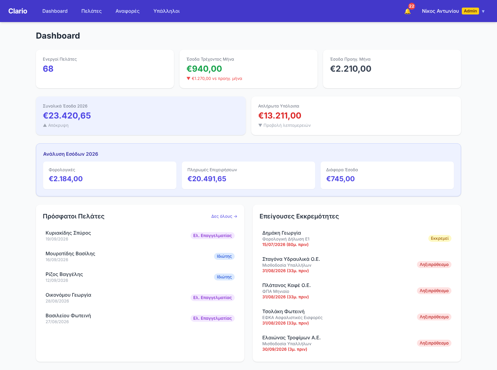
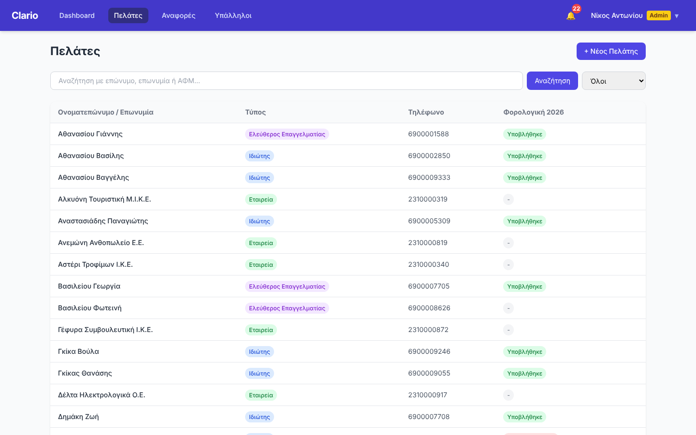
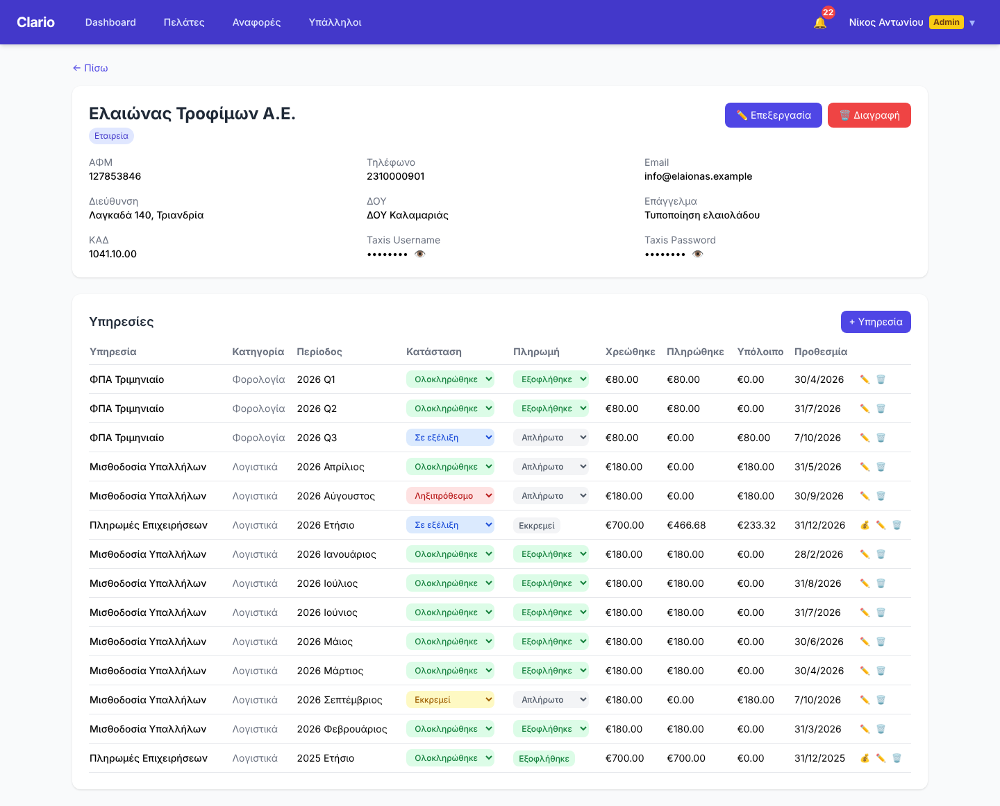
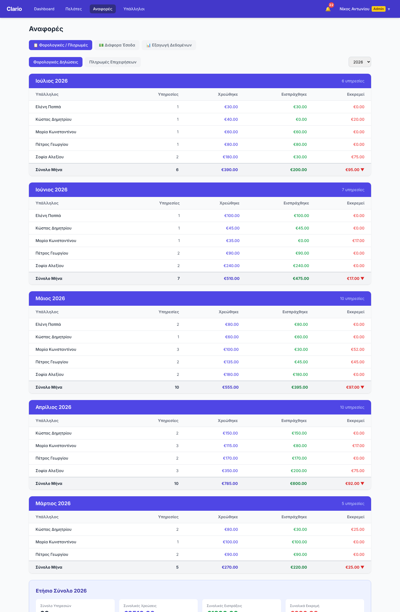
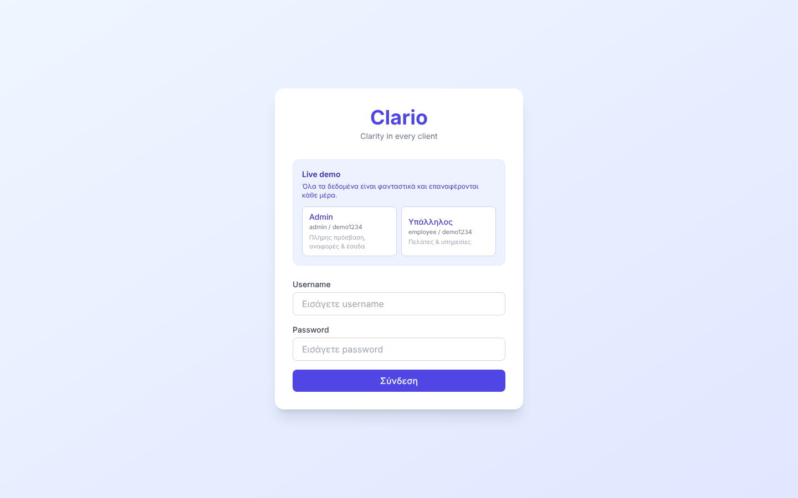
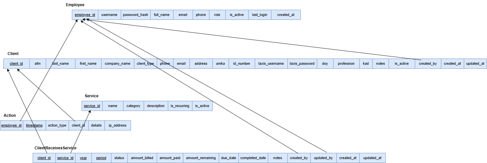

# Clario — *Clarity in every client*


### 🔗 [Live demo](https://clario-demo-puce.vercel.app)

*All data in the demo is fictional and is reset every day. Log in with one click as **Admin** or **Employee**.*

Clario is a full-stack CRM for a Greek accounting office. I built it as a freelance project and it is used
in production by the office's staff to manage clients, recurring tax and accounting work, deadlines and payments.
The interface is in Greek, since that is the language of its users.



## Features

- **Clients**: individuals, freelancers and companies, with search by name, company name or ΑΦΜ (tax ID).
- **Encrypted sensitive data**: ΑΦΜ, ΑΜΚΑ, ID number and Taxisnet credentials are encrypted at rest with
  Fernet (AES). A SHA-256 hash of the ΑΦΜ allows exact search without decrypting every row.
- **Services per client and period**: tax returns (Ε1), monthly or quarterly VAT, payroll, social-security
  contributions and one-off services. Each has a status, a deadline, the amount billed and the amount paid.
- **Automatic overdue detection**: unfinished work past its deadline is marked as overdue.
- **Notifications**: deadlines in the next 7 days, grouped by service.
- **Instalments**: annual fees paid in instalments, with the balance updated automatically.
- **Dashboard** (admin): current and previous month income, yearly income breakdown, unpaid balances and
  urgent deadlines.
- **Reports** (admin): revenue per employee and month, unpaid tax returns, business payments by year, other
  income, and a year-over-year comparison of which clients have not yet been served this year.
- **Excel export** of all pending work.
- **Roles and audit log**: admin and employee roles with JWT authentication. Every employee action is logged
  and visible to the admin (GDPR audit trail).

| Clients | Client card |
|---|---|
|  |  |

| Reports | Login (demo) |
|---|---|
|  |  |

## Tech stack

| Layer | Technology |
|---|---|
| Frontend | React 19, TypeScript, Vite, Tailwind CSS, React Router, Axios |
| Backend | Python, FastAPI, Pydantic, python-jose (JWT), bcrypt, cryptography (Fernet), openpyxl |
| Database | MySQL 8 (generated columns, views, foreign keys, JSON) |
| Production | Windows server on the office LAN, Nginx serving the frontend build, Uvicorn for the API |
| Live demo | Vercel (frontend and FastAPI) and Aiven for MySQL |

## Database



The diagrams in [`database/design`](database/design) show the initial design: ER diagram, relational schema and
MySQL Workbench model. As the app grew, three more tables were added: `client_payment` (instalments),
`client_document` (uploaded files) and `misc_income`. The full current schema is in
[`backend/db/schema.sql`](backend/db/schema.sql).

| Table | Purpose |
|---|---|
| `employee` | Office staff, role (`admin` / `employee`), bcrypt password hash |
| `client` | Clients; sensitive fields encrypted |
| `service` | Catalogue of services the office offers |
| `client_service` | A service for a client and period (M:N); `amount_remaining` is a generated column |
| `client_payment` | Instalments towards an annual fee |
| `client_document` | Uploaded PDFs and images per client |
| `misc_income` | Other office income |
| `action` | Audit log of employee actions |

## Running locally

**Requirements:** Python 3.11+, Node.js 20+, MySQL 8.

**1. Database**

```sql
CREATE DATABASE clario CHARACTER SET utf8mb4 COLLATE utf8mb4_unicode_ci;
```

**2. Backend**

```bash
cd backend
python -m venv venv
source venv/bin/activate          # Windows: venv\Scripts\activate
pip install -r requirements.txt
cp .env.example .env              # then fill in DB credentials, ENCRYPTION_KEY and SECRET_KEY
python -m db.seed                 # creates the tables and loads the fake demo data
uvicorn main:app --reload         # http://localhost:8000 (API docs at /docs)
```

**3. Frontend**

```bash
cd frontend
npm install
cp .env.example .env
npm run dev                       # http://localhost:5173
```

Log in with `admin` / `demo1234` or `employee` / `demo1234`.

> ⚠️ `python -m db.seed` **drops all tables** before loading the demo data. Never run it against a real database.

## Live demo deployment

| Part | Hosting |
|---|---|
| Frontend | Vercel, static site (project root: `frontend`) |
| Backend | Vercel, FastAPI as a Python function (project root: `backend`) |
| Database | Aiven for MySQL (free tier, SSL) |

In the demo (`DEMO_MODE=true`), file uploads are disabled and the two demo accounts cannot be edited or
deactivated. A daily [Vercel Cron Job](backend/vercel.json) calls `/api/cron/reset-demo`, protected by
`CRON_SECRET`. The endpoint rebuilds the database with fake data generated relative to the current date,
so the demo always has upcoming deadlines and current-month income. The environment variables are
documented in [`backend/.env.example`](backend/.env.example) and [`frontend/.env.example`](frontend/.env.example).

## About the demo data

The real office data never leaves the office server and is not part of this repository.
The demo data is generated by [`backend/db/seed.py`](backend/db/seed.py). All names, companies, phone
numbers and amounts are invented, and any resemblance to real people or businesses is coincidental. The
generated ΑΦΜ and ΑΜΚΑ numbers deliberately fail the official check-digit algorithms, so none of them can be
a valid real number.

## Project structure

```
clario/
├── backend/
│   ├── main.py              # FastAPI app: all API endpoints
│   ├── models.py            # Pydantic request/response models
│   ├── auth.py              # JWT tokens and bcrypt password hashing
│   ├── encryption.py        # Fernet encryption of sensitive fields, ΑΦΜ hashing
│   ├── database.py          # MySQL connection (optional SSL)
│   ├── db/
│   │   ├── schema.sql       # Full database schema
│   │   └── seed.py          # Fake demo data generator / reset
│   └── vercel.json          # Daily demo reset (cron)
├── frontend/
│   └── src/
│       ├── pages/           # Dashboard, Clients, ClientCard, Reports, Employees, ...
│       ├── components/      # Navbar with notifications
│       ├── context/         # Auth context (role-based UI)
│       └── api/axios.ts     # API client with JWT interceptor
├── database/
│   ├── design/              # ER diagram, relational schema, Workbench model
│   └── queries/             # Example SQL queries
└── docs/screenshots/
```

## Author

**Elisavet Stougiannou**: design, database, backend and frontend.
